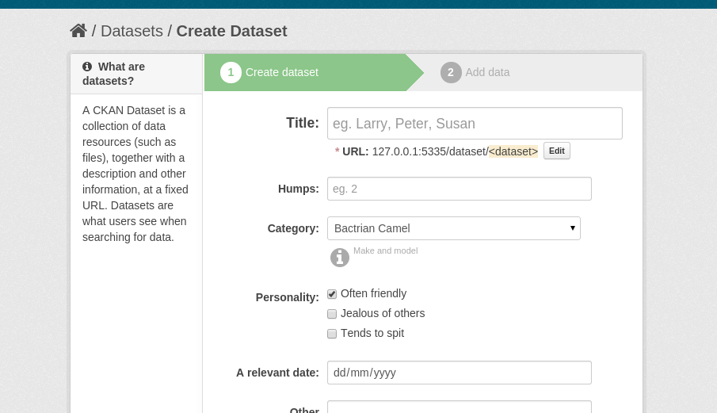

ckanapi and ckanext-scheming
----------------------------

CKANCon 2015
============

Ian Ward
~~~~~~~~

`open.canada.ca <http://open.canada.ca/>`_

`www.datacats.com <http://www.datacats.com/>`_

Python + Open Source developer
------------------------------

`github.com/wardi <https://github.com/wardi>`_

CKAN core
---------

.. image:: contributions.png
   :scale: 50%

open.canada.ca
--------------

.. image:: opencanada.png
   :scale: 40%

ckanext-fluent
--------------

`github.com/open-data/ckanext-fluent <https://github.com/open-data/ckanext-fluent>`_

.. image:: multilingual-display.png
   :scale: 70%

.. code-block:: json

    "books": {"en": "Franklin", "fr": "Benjamin"}

ckanext-recombinant
-------------------

`github.com/open-data/ckanext-recombinant <https://github.com/open-data/ckanext-recombinant>`_

CKAN Multisite
--------------

`github.com/boxkite/ckan-multisite <https://github.com/boxkite/ckan-multisite/>`_

datacats
--------

`github.com/datacats/datacats <https://github.com/datacats/datacats>`_

.. image:: datacats-ref.png
   :scale: 48%

www.datacats.com
----------------

ckanapi
-------

`github.com/ckan/ckanapi <https://github.com/ckan/ckanapi>`_

ckanext-scheming
----------------

`github.com/open-data/ckanext-scheming <https://github.com/open-data/ckanext-scheming>`_

I ♥ CKAN
--------

CKAN layers
-----------

.. image:: ckan-layers0.png
   :scale: 50%

Extending CKAN
--------------

.. image:: ckan-layers1.png
   :scale: 50%

ckanapi
-------

`github.com/ckan/ckanapi <https://github.com/ckan/ckanapi>`_

1. Python library for calling ckan actions
2. Command-line client for calling ckan actions

Python library
--------------

Pass strings, lists, dicts, file objects like normal method calls

.. code-block:: python

    import ckanapi

    ckan = ckanapi.LocalCKAN()
    with open('mydata.csv') as csv:
        ckan.action.package_create(name='best-dataset', title='Best evar')
        ckan.action.resource_create(package_id='best-dataset', upload=csv)

Safe
----

* Raises exceptions on errors, no manual error checking
* Clean context and data_dict for every call

Universal
---------

* Python 2.6, 2.7, 3.2+ (source-compatible)
* Generic, no per-action custom code

Consistent interface
--------------------

* LocalCKAN for core or extensions
* RemoteCKAN for remote API calls
* TestAppCKAN for tests

ckanapi Python library
----------------------

.. code-block:: bash

    pip install ckanapi

.. code-block:: python

    import ckanapi

Command-line client
-------------------

* Single and bulk actions
* Easy to pipeline
* Local and remote

Single actions
--------------

Pass strings as simple parameters

.. code-block:: bash

    ckanapi action package_create name=best-dataset title="Best evar"
    ckanapi action package_list

Bulk actions
------------

.. code-block:: bash

    ckanapi dump datasets
    ckanapi dump organizations
    ckanapi dump groups

Bulk actions
------------

.. code-block:: bash

    ckanapi load datasets
    ckanapi load organizations
    ckanapi load groups

Bulk actions
------------

.. code-block:: bash

    ckanapi load datasets -p 3
    ckanapi load organizations -p 3
    ckanapi load groups -p 3

Pipelining
----------

.. code-block:: bash

    ckanapi dump datasets | ssh otherbox ckanapi load datasets -p 3

Local and remote
----------------

.. code-block:: bash

    ckanapi dump datasets -r http://sourceckan | ckanapi load datasets -p 3

Bulk Data Format
----------------

* JSON Lines
* Consistent order with sorted keys

Track metadata in git
---------------------

.. code-block:: bash

    ckanapi dump datasets > datasets.jsonl
    git diff datasets.jsonl --stat

    datasets.jsonl | 52 ++++++++++++++++++++++++++++++++++++----------------
    1 file changed, 36 insertions(+), 16 deletions(-)

Distributed load
----------------

.. code-block:: bash

    split -n l/3 datasets.jsonl part
    ckanapi load datasets -r http://web1 -a ... < partaa &
    ckanapi load datasets -r http://web2 -a ... < partab &
    ckanapi load datasets -r http://web3 -a ... < partac &

Summaries
---------

.. code-block:: bash

    head -5 datasets.jsonl | jq .title

    "Exports of Dairy Products by Country of Destination Dairy Year 2001/02"
    "Historical Border Wait Times"
    "Number of Head Slaughtered in Federally Inspected Plants 2009 Hogs"
    "Canadian Dairy Exports Month Calendar Year 2001 September"
    "Federal Corporations"

Reports
-------

.. code-block:: bash

    jq 'select(.organization.name!="nrcan-rncan")' -c datasets.jsonl | wc -l

    8613

Command-line client
-------------------

.. code-block:: bash

    pip install ckanapi
    ckanapi -h

CKAN layers
-----------

.. image:: ckan-layers2.png
   :scale: 50%

CKAN layers
-----------

.. image:: ckan-layers3.png
   :scale: 50%

IDatasetForm is awesome
-----------------------

* Define dataset types
* Custom templates for edit + show
* New fields + validation rules for datasets + resources

IDatasetForm is hard
--------------------

* Python plugin code
* Nested Jinja2 templates
* navl schema + validators

ckanext-scheming is easier
--------------------------

* Code optional
* Templates included
* Combined JSON schema
* Custom validators with IValidators

ckanext-scheming is sharable
----------------------------

* scheming_dataset_schema_list
* scheming_dataset_schema_show

Example schema
--------------

.. code-block:: json

    {
      "dataset_type": "camel-photos",
      "dataset_fields": [
	{
	  "field_name": "title",
	  "label": "Title",
	  "form_placeholder": "eg. Larry, Peter, Susan",
	  "form_snippet": "large_text.html",
	  "form_attrs": { "data-module": "slug-preview-target" },
	  "validators": "if_empty_same_as(name) unicode"
	},
	{
	  "field_name": "name",
	  "label": "URL",
	  "form_placeholder": "eg. camel-no-5",
	  "form_snippet": "slug.html",
	  "validators": "not_empty unicode name_validator package_name_validator"
	},

Example schema
--------------

.. code-block:: json

    {
      "dataset_type": "camel-photos",
      "dataset_fields": [
	{
	  "field_name": "title",
	  "label": "Title",
	  "form_placeholder": "eg. Larry, Peter, Susan",
	  "preset": "title"

	},
	{
	  "field_name": "name",
	  "label": "URL",
	  "form_placeholder": "eg. camel-no-5",
	  "preset": "dataset_slug"

	},

Example schema
--------------

.. code-block:: json

	{
	  "field_name": "category",
	  "label": "Category",
	  "help_text": "Make and model",
	  "help_inline": true,
	  "preset": "select",
	  "choices": [
	    { "value": "bactrian", "label": "Bactrian Camel" },
	    { "value": "hybrid", "label": "Hybrid Camel" },
	    { "value": "f2hybrid", "label": "F2 Hybrid Camel" },
	    { "value": "snowwhite", "label": "Snow-white Dromedary" },
	    { "value": "black", "label": "Black Camel" }
	  ]
	},

Example schema
--------------

.. code-block:: json

	{
	  "field_name": "personality",
	  "label": "Personality",
	  "preset": "multiple_checkbox",
	  "choices": [
	    { "value": "friendly", "label": "Often friendly" },
	    { "value": "jealous", "label": "Jealous of others" },
	    { "value": "spits", "label": "Tends to spit" }
	  ]
	},
	{
	  "field_name": "a_relevant_date",
	  "label": "A relevant date",
	  "preset": "date"
	},

Example form
------------

Future
------

* Groups and organizations
* Search facets
* Schema registry?

ckanapi and ckanext-scheming
----------------------------

* `github.com/ckan/ckanapi <https://github.com/ckan/ckanapi>`_
* `github.com/open-data/ckanext-scheming <https://github.com/open-data/ckanext-scheming>`_

Questions?
==========

ian@datacats.com
