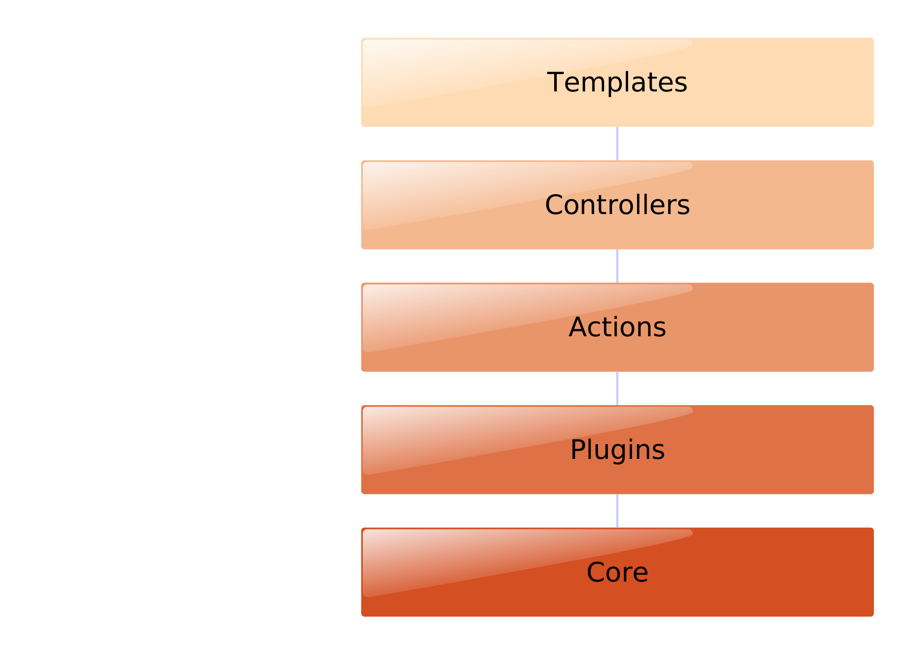
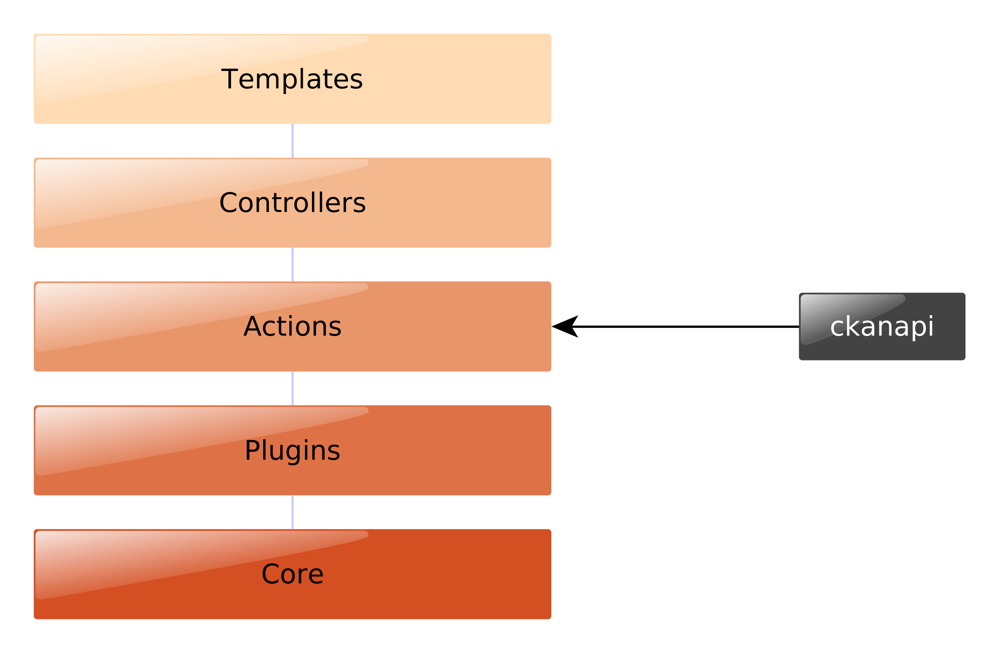

ckanapi and ckanext-scheming
----------------------------

CKANCON 2015

Ian Ward

http://datacats.com/

http://open.canada.ca/

http://ckan.org/

I ♥ ckan
--------

layers of ckan
--------------

extending ckan
--------------

.. image:: ckan-layers1.png
   :scale: 50%

ckanapi
-------

https://github.com/ckan/ckanapi

* a python library for calling ckan actions
* a command-line client for calling ckan actions

python library
--------------

* pass strings, lists, dicts, file objects like normal method calls

.. code-block:: python

    import ckanapi

    ckan = ckanapi.LocalCKAN()
    with open('mydata.csv') as csv:
        ckan.action.package_create(name='best-dataset', title='Best evar')
        ckan.action.resource_create(package_id='best-dataset', upload=csv)

safe
----

* raises exceptions on errors, no manual error checking
* clean context and data_dict for every call
* has great test coverage

universal
---------

* python 2.6, 2.7, 3.2, 3.3, 3.4 (source-compatible)
* generic, no per-action custom code
* same interface for use

  * from core or extensions: LocalCKAN
  * for remote API calls: RemoteCKAN
  * in tests: TestAppCKAN

core?
-----

* ckan/lib/cli.py

ckanapi python library
----------------------

.. code-block:: bash

    pip install ckanapi

.. code-block:: python

    import ckanapi

command-line client
-------------------

* single + bulk actions
* easy to pipeline
* local + remote

single actions
--------------

* pass strings and files as simple parameters

.. code-block:: bash

    ckanapi action package_create name=best-dataset title="Best evar"
    ckanapi action resource_create package_id=best-dataset upload=@mydata.csv

bulk actions
------------

.. code-block:: bash

    ckanapi dump datasets
    ckanapi dump organizations
    ckanapi dump groups

bulk actions
------------

.. code-block:: bash

    ckanapi load datasets
    ckanapi load organizations
    ckanapi load groups

bulk actions
------------

.. code-block:: bash

    ckanapi load datasets -p 3
    ckanapi load organizations -p 3
    ckanapi load groups -p 3

pipelining
----------

.. code-block:: bash

    ckanapi dump datasets \
        | ssh otherbox ckanapi load datasets -p 3

local + remote
--------------

.. code-block:: bash

    ckanapi dump datasets -r http://sourceckan \
        | ckanapi load datasets -p 3

bulk data tricks
----------------

* JSON Lines
* consistent order and sorted keys

track metadata in git
---------------------

.. code-block:: bash

    ckanapi dump datasets > datasets.jsonl
    git diff datasets.jsonl --stat

    datasets.jsonl | 52 ++++++++++++++++++++++++++++++++++++----------------
    1 file changed, 36 insertions(+), 16 deletions(-)

distributed load
----------------

.. code-block:: bash

    split -n l/3 datasets.jsonl
    ckanapi load datasets -r http://web1 -a ... < xaa &
    ckanapi load datasets -r http://web2 -a ... < xab &
    ckanapi load datasets -r http://web3 -a ... < xac &

summaries
---------

.. code-block:: bash

    head -5 datasets.jsonl | jq .title

    "Exports of Dairy Products by Country of Destination Dairy Year 2001/02"
    "Historical Border Wait Times"
    "Number of Head Slaughtered in Federally Inspected Plants 2009 Hogs"
    "Canadian Dairy Exports Month Calendar Year 2001 September"
    "Federal Corporations"

reports
-------

.. code-block:: bash

    jq 'select(.organization.name!="nrcan-rncan")' -c datasets.jsonl | wc -l

    8613

command-line client
-------------------

.. code-block:: bash

    pip install ckanapi
    ckanapi -h

layers of ckan
--------------

layers of ckan
--------------

.. image:: ckan-layers3.png
   :scale: 50%

IDatasetForm is awesome
-----------------------

* define one or more dataset types
* custom templates for edit + show
* new metadata fields
* custom validation rules for dataset + resource fields

IDatasetForm is hard
--------------------

* Python plugin code
* nested Jinja2 templates with macros
* navl schema
* navl validators

ckanext-scheming is easier
--------------------------

* No code required
* Templates for common field types included
* Combined JSON or YAML schema
* Add validators with a simple IValidators plugin

ckanext-scheming is sharable
----------------------------

* scheming_dataset_schema_list
* scheming_dataset_schema_show

future
------

* IGroupForm for groups and organizations
* ckanext-fluent
* http://open.canada.ca

