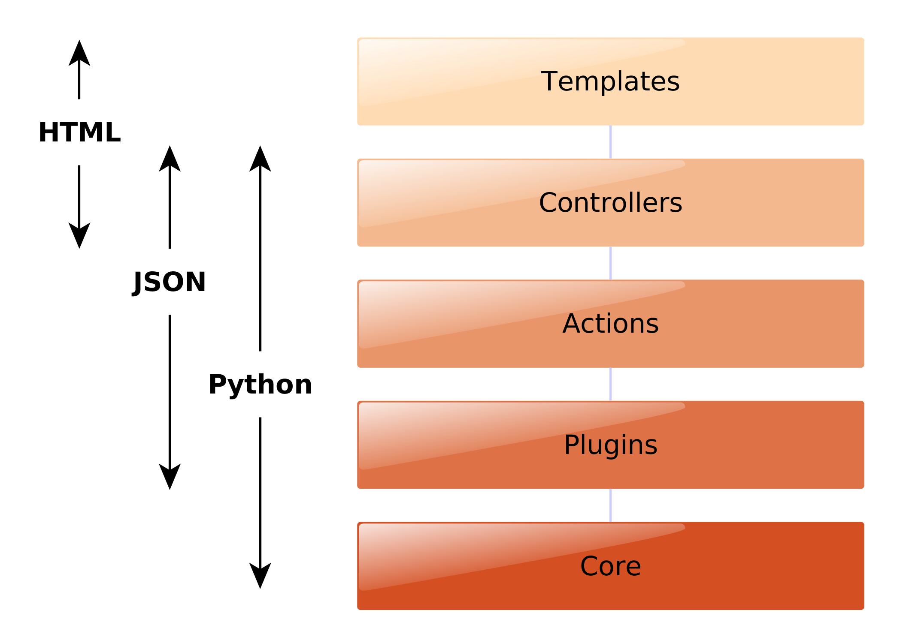
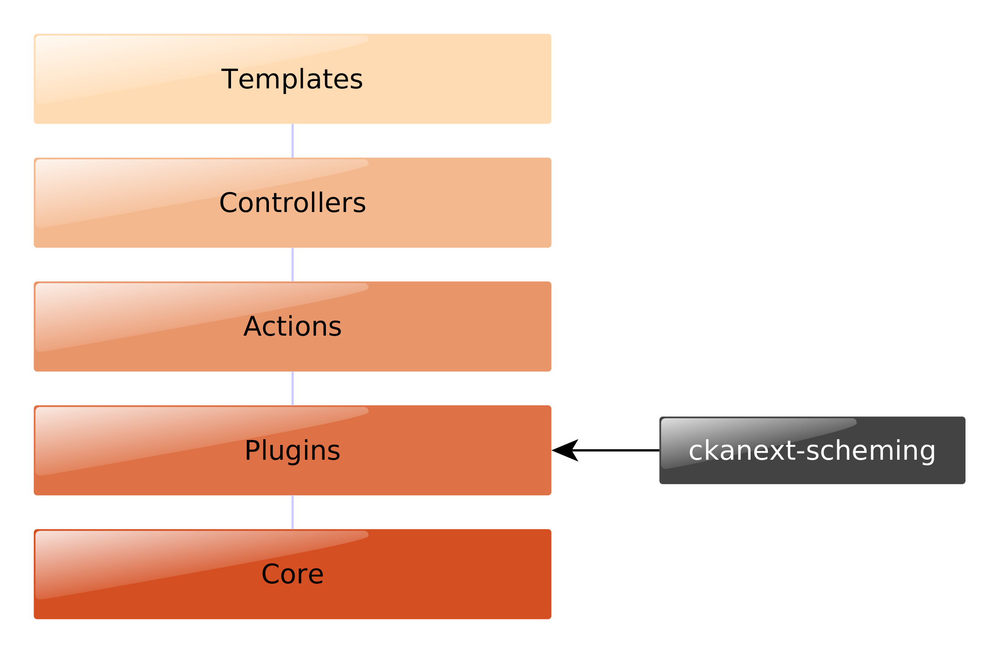

ckanapi and ckanext-scheming
----------------------------

CKANCon 2015
============

Ian Ward
~~~~~~~~

`open.canada.ca <http://open.canada.ca/>`_

`www.datacats.com <http://www.datacats.com/>`_

Python + Open Source developer
------------------------------

`github.com/wardi <https://github.com/wardi>`_

.. image:: all-contributions.png
   :scale: 50%

CKAN core
---------

open.canada.ca
--------------

ckanext-fluent
--------------

`github.com/open-data/ckanext-fluent <https://github.com/open-data/ckanext-fluent>`_

.. image:: multilingual-form.png
   :scale: 70%

.. code-block:: json

    "books": {"en": "Franklin", "fr": "Benjamin"}

ckanext-recombinant
-------------------

`github.com/open-data/ckanext-recombinant <https://github.com/open-data/ckanext-recombinant>`_

CKAN Multisite
--------------

`github.com/boxkite/ckan-multisite <https://github.com/boxkite/ckan-multisite/>`_

.. image:: ckan-multisite.png
   :scale: 180%

datacats
--------

`github.com/datacats/datacats <https://github.com/datacats/datacats>`_

www.datacats.com
----------------

.. image:: datacats.png
   :scale: 48%

ckanapi
-------

`github.com/ckan/ckanapi <https://github.com/ckan/ckanapi>`_

ckanext-scheming
----------------

`github.com/open-data/ckanext-scheming <https://github.com/open-data/ckanext-scheming>`_

I ♥ CKAN
--------

CKAN layers
-----------

.. image:: ckan-layers0.png
   :scale: 50%

Extending CKAN
--------------

ckanapi
-------

`github.com/ckan/ckanapi <https://github.com/ckan/ckanapi>`_

1. Python library for calling ckan actions
2. Command-line client for calling ckan actions

Python library
--------------

pass strings, lists, dicts, file objects like normal method calls

.. code-block:: python

    import ckanapi

    ckan = ckanapi.LocalCKAN()
    with open('mydata.csv') as csv:
        ckan.action.package_create(name='best-dataset', title='Best evar')
        ckan.action.resource_create(package_id='best-dataset', upload=csv)

Safe
----

* raises exceptions on errors, no manual error checking
* clean context and data_dict for every call
* has great test coverage

Universal
---------

* python 2.6, 2.7, 3.2, 3.3, 3.4 (source-compatible)
* generic, no per-action custom code
* same interface for use

  * from core or extensions: LocalCKAN
  * for remote API calls: RemoteCKAN
  * in tests: TestAppCKAN

ckanapi Python library
----------------------

.. code-block:: bash

    pip install ckanapi

.. code-block:: python

    import ckanapi

Command-line client
-------------------

* single + bulk actions
* easy to pipeline
* local + remote

Single actions
--------------

* pass strings as simple parameters

.. code-block:: bash

    ckanapi action package_create name=best-dataset title="Best evar"
    ckanapi action package_list

Bulk actions
------------

.. code-block:: bash

    ckanapi dump datasets
    ckanapi dump organizations
    ckanapi dump groups

Bulk actions
------------

.. code-block:: bash

    ckanapi load datasets
    ckanapi load organizations
    ckanapi load groups

Bulk actions
------------

.. code-block:: bash

    ckanapi load datasets -p 3
    ckanapi load organizations -p 3
    ckanapi load groups -p 3

Pipelining
----------

.. code-block:: bash

    ckanapi dump datasets \
        | ssh otherbox ckanapi load datasets -p 3

local + remote
--------------

.. code-block:: bash

    ckanapi dump datasets -r http://sourceckan \
        | ckanapi load datasets -p 3

Bulk Data Format
----------------

* JSON Lines
* Consistent order with sorted keys

Track metadata in git
---------------------

.. code-block:: bash

    ckanapi dump datasets > datasets.jsonl
    git diff datasets.jsonl --stat

    datasets.jsonl | 52 ++++++++++++++++++++++++++++++++++++----------------
    1 file changed, 36 insertions(+), 16 deletions(-)

Distributed load
----------------

.. code-block:: bash

    split -n l/3 datasets.jsonl part
    ckanapi load datasets -r http://web1 -a ... < partaa &
    ckanapi load datasets -r http://web2 -a ... < partab &
    ckanapi load datasets -r http://web3 -a ... < partac &

Summaries
---------

.. code-block:: bash

    head -5 datasets.jsonl | jq .title

    "Exports of Dairy Products by Country of Destination Dairy Year 2001/02"
    "Historical Border Wait Times"
    "Number of Head Slaughtered in Federally Inspected Plants 2009 Hogs"
    "Canadian Dairy Exports Month Calendar Year 2001 September"
    "Federal Corporations"

Reports
-------

.. code-block:: bash

    jq 'select(.organization.name!="nrcan-rncan")' -c datasets.jsonl | wc -l

    8613

command-line client
-------------------

.. code-block:: bash

    pip install ckanapi
    ckanapi -h

CKAN layers
-----------

.. image:: ckan-layers2.png
   :scale: 50%

CKAN layers
-----------

IDatasetForm is awesome
-----------------------

* Define dataset types
* Custom templates for edit + show
* New fields + validation rules for datasets + resources

IDatasetForm is hard
--------------------

* Python plugin code
* Nested Jinja2 templates
* navl schema + validators

ckanext-scheming is easier
--------------------------

* Code optional
* Templates included
* Combined JSON schema
  * Add validators with IValidators

ckanext-scheming is sharable
----------------------------

* scheming_dataset_schema_list
* scheming_dataset_schema_show

Example schema
--------------

.. code-block:: json

    {
      "dataset_type": "camel-photos",
      "dataset_fields": [
	{
	  "field_name": "title",
	  "label": "Title",
	  "preset": "title",
	  "form_placeholder": "eg. Larry, Peter, Susan"
	},
	{
	  "field_name": "name",
	  "label": "URL",
	  "preset": "dataset_slug",
	  "form_placeholder": "eg. camel-no-5"
	},

Example schema
--------------

.. code-block:: json

    {
      "field_name": "humps",
      "label": "Humps",
      "validators": "ignore_missing int_validator",
      "form_placeholder": "eg. 2"
    },
    {
      "field_name": "category",
      "label": "Category",
      "help_text": "Make and model",
      "help_inline": true,
      "preset": "select",
      "choices": [
        {
          "value": "bactrian",
          "label": "Bactrian Camel"
        },
        {
          "value": "hybrid",

future
------

* IGroupForm for groups and organizations
* ckanext-fluent
* http://open.canada.ca

